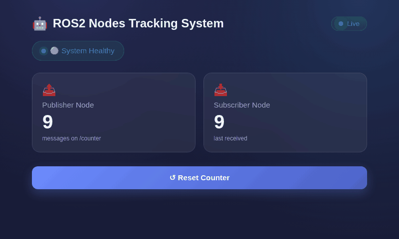
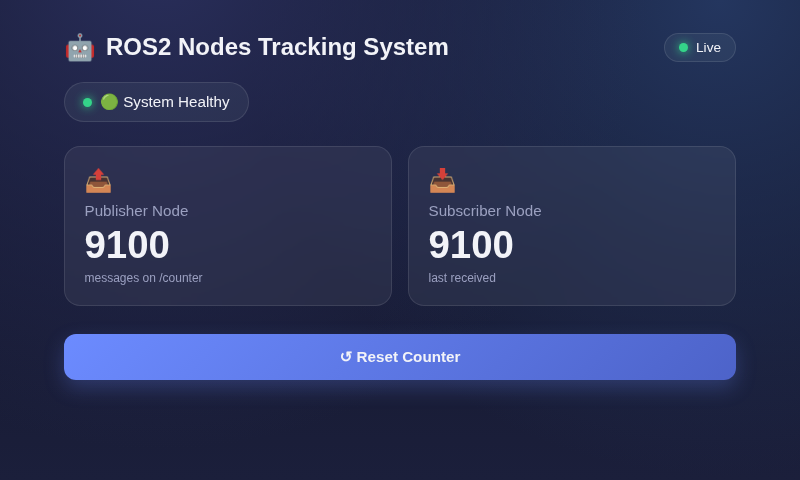
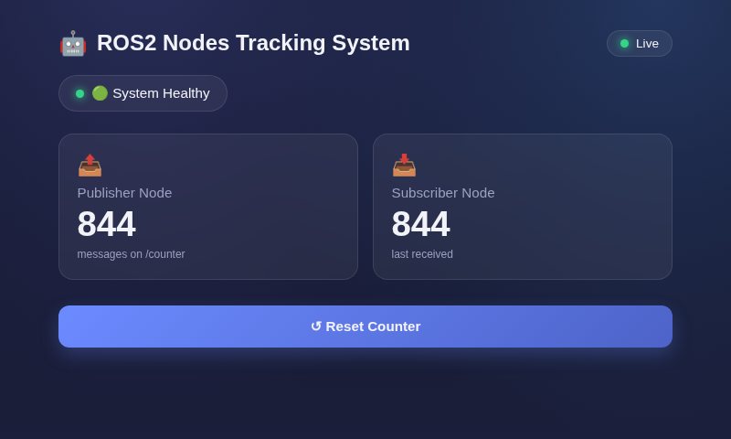

# ROS2 Monitoring System

A full-stack ROS2 monitoring application built to demonstrate modern CI/CD practices using ROS2, FastAPI, Docker, Docker Compose, GitHub Actions, DockerHub, Kubernetes, Helm, and ArgoCD.

---

# Overview

The ROS2 Monitoring System simulates a simple robotics platform where ROS2 nodes communicate through topics and services, while a web-based dashboard provides real-time visibility into system health and data flow.

This project serves as a practical learning platform for:

* ROS2 Development
* FastAPI Backend Development
* WebSocket Communication
* Docker Containerization
* Continuous Integration (CI) and Continuous Deployment (CD)
* Container Registry Management
* Kubernetes Deployment with Helm
* GitOps with ArgoCD

---

# Live Demo

The dashboard streams live publisher/subscriber counts over a WebSocket
and reflects real ROS2 health — this is the actual app, not a mockup:



| Docker Compose (`localhost:8080`) | Kubernetes via Ingress (`ros2.local`) |
| --- | --- |
|  |  |

Same frontend, same backend image family, two different deployment paths —
see [Getting Started](#getting-started) for Docker Compose and
[Kubernetes Deployment](#kubernetes-deployment-helm--argocd-gitops) for the
Helm + ArgoCD path.

---

# Architecture

```text
                     Browser
                        │
                        │ HTTP / WebSocket
                        ▼
              ┌─────────────────┐
              │     FastAPI     │
              │ Backend Bridge  │
              └────────┬────────┘
                       │
                       │ ROS2
                       ▼

         ┌───────────────────────────┐
         │      ROS2 Middleware      │
         └───────────────────────────┘

                 Topic: /counter

          ┌────────────────────┐
          │ Publisher Node     │
          │ (C++)              │
          └─────────┬──────────┘
                    │
                    ▼

              0,1,2,3,4...

                    │
                    ▼

          ┌────────────────────┐
          │ Subscriber Node    │
          │ (C++)              │
          └────────────────────┘

                    ▲
                    │
                    │
          Service: /reset_counter
                    │
                    ▼

              FastAPI /reset
```

---

# Features

## Publisher Node

* Written in C++
* Publishes incrementing integers
* Topic: `/counter`
* Publishing Rate: 1 Hz

Example:

```text
0
1
2
3
4
5
...
```

---

## Subscriber Node

* Written in C++
* Subscribes to `/counter`
* Receives latest publisher value

Example:

```text
Received: 25
Received: 26
Received: 27
```

---

## Reset Service

ROS2 Service:

```text
/reset_counter
```

Allows resetting the publisher counter back to zero.

---

## FastAPI Backend

Provides:

### Health Endpoint

```http
GET /health
```

Returns:

```json
{
  "publisher": true,
  "subscriber": true,
  "system": true
}
```

### Reset Endpoint

```http
POST /reset
```

Triggers ROS2 reset service.

### WebSocket Endpoint

```http
/ws
```

Streams live publisher/subscriber updates to the dashboard.

---

## Frontend Dashboard

Displays:

* System Health Status
* Publisher Counter Value
* Subscriber Counter Value
* Reset Counter Button

Example:

```text
----------------------------------
 ROS2 Nodes Tracking System
----------------------------------

 🟢 Healthy

 Publisher Node

 123

 Subscriber Node

 123

 [ Reset Counter ]
----------------------------------
```

---

# Technology Stack

| Layer            | Technology                |
| ---------------- | ------------------------- |
| Frontend         | HTML, CSS, JavaScript     |
| Backend          | FastAPI                   |
| Middleware       | ROS2 Humble               |
| Languages        | C++, Python                |
| Containerization | Docker                    |
| Local Deployment | Docker Compose            |
| Orchestration    | Kubernetes (minikube)     |
| Packaging        | Helm                      |
| Ingress          | NGINX Ingress Controller  |
| GitOps           | ArgoCD                    |
| CI Platform      | GitHub Actions            |
| CD Platform      | GitHub Actions + ArgoCD   |
| Registry         | DockerHub                 |
| Testing          | Pytest                    |
| Linting          | Ruff                      |
| Security         | Bandit                    |

---

# Repository Structure

```text
ros2-monitoring-system/

├── ros2_ws/
│   └── src/
│       └── counter_system/
│
├── backend/
│   ├── app.py
│   ├── ros_bridge.py
│   ├── requirements.txt
│   ├── requirements-dev.txt
│   └── tests/
│
├── frontend/
│   ├── index.html
│   ├── app.js
│   └── styles.css
│
├── docker/
│   ├── ros2.Dockerfile
│   ├── backend.Dockerfile
│   ├── frontend.Dockerfile
│   ├── start_ros.sh
│   ├── start_backend.sh
│   └── print_url.sh
│
├── docker-compose.yml
│
├── k8s/                       # plain manifests (superseded by helm/, kept for reference)
│   ├── namespace.yaml
│   ├── configmap.yaml
│   ├── secrets.yaml
│   ├── ingress.yaml
│   ├── backend/
│   └── frontend/
│
├── helm/
│   └── ros2-cicd/              # the chart that actually deploys everything
│       ├── Chart.yaml
│       ├── values.yaml
│       └── templates/
│           ├── namespace.yaml
│           ├── configmap.yaml
│           ├── secret.yaml
│           ├── backend-deployment.yaml
│           ├── backend-service.yaml
│           ├── frontend-deployment.yaml
│           ├── frontend-service.yaml
│           ├── ros2-deployment.yaml
│           └── ingress.yaml
│
├── argocd/
│   └── application.yaml        # ArgoCD Application watching this repo
│
└── .github/
    └── workflows/
        └── ci.yml               # CI job + CD job (bumps Helm image tags)
```

---

# Prerequisites

Install:

### Git

```bash
git --version
```

### Docker

```bash
docker --version
```

### Docker Compose

```bash
docker compose version
```

Verify Docker is running:

```bash
docker ps
```

---

# Getting Started

## Clone Repository

```bash
git clone <repository-url>

cd ros2-monitoring-system
```

---

## Build All Containers

```bash
docker compose build
```

Expected:

```text
✔ ros2 image built

✔ backend image built

✔ frontend image built
```

---

## Start Application

```bash
docker compose up
```

or run in detached mode:

```bash
docker compose up -d
```

---

## Verify Running Containers

```bash
docker ps
```

Expected:

```text
ros2

backend

frontend
```

---

# Access Application

## Frontend Dashboard

Open browser:

```text
http://localhost:8080
```

---

## FastAPI API

```text
http://localhost:8000
```

---

## FastAPI Swagger Documentation

```text
http://localhost:8000/docs
```

---

# Test Backend APIs

## Health Endpoint

```bash
curl http://localhost:8000/health
```

Expected:

```json
{
  "publisher": true,
  "subscriber": true,
  "system": true
}
```

---

## Reset Endpoint

```bash
curl -X POST http://localhost:8000/reset
```

Expected:

```json
{
  "message": "reset sent"
}
```

---

# View Logs

## All Containers

```bash
docker compose logs -f
```

---

## Backend Only

```bash
docker compose logs -f backend
```

---

## ROS2 Only

```bash
docker compose logs -f ros2
```

---

## Frontend Only

```bash
docker compose logs -f frontend
```

---

# Stop Application

```bash
docker compose down
```

---

# Kubernetes Deployment (Helm + ArgoCD GitOps)

Docker Compose is the quick local path above. This is the production-style
path: the whole app (frontend, backend, ROS2) runs in Kubernetes, packaged
as a Helm chart, deployed and kept in sync by ArgoCD.

## How it fits together

```text
   git push
       │
       ▼
GitHub Actions (CI)
  lint / test / coverage / security scan
  build + push images to DockerHub
       │
       ▼
GitHub Actions (CD)
  bump helm/ros2-cicd/values.yaml image tags
  commit + push  [skip ci]
       │
       ▼
   GitHub repo               <- git is the source of truth
       │
       │  ArgoCD polls this repo
       ▼
   ArgoCD (running inside the cluster)
  renders helm/ros2-cicd, applies it, self-heals any drift
       │
       ▼
   Kubernetes (minikube)
       │
   ┌───┴──────────────────────┐
   ▼                          ▼
Ingress (nginx)
 ros2.local  ──────────► frontend-service ──► frontend Pods
 api.ros2.local ───────► backend-service  ──► backend Pods (2 replicas)
                                                    │
                                                    │ rclpy / DDS
                                                    ▼
                                              ros2 Deployment
                                        publisher_node + subscriber_node
```

GitHub Actions never touches the cluster directly — it only pushes to git.
ArgoCD, running inside the cluster, pulls from git itself. That split means
no cluster credentials ever have to leave your machine, which is what makes
this work against a cluster GitHub's cloud runners can't reach (like a
local minikube).

**To deploy a change: `git push`. That's it.** CI builds and publishes new
images, CD points the chart at them, ArgoCD notices and rolls them out.
No manual `kubectl apply` or `helm upgrade` needed once this is running.

## One-time setup

```bash
# 1. Start the cluster and enable the ingress controller
minikube start
minikube addons enable ingress
kubectl get pods -n ingress-nginx        # wait for the controller to be Running

# 2. Point the ingress hostnames at minikube
echo "$(minikube ip)    ros2.local
$(minikube ip)    api.ros2.local" | sudo tee -a /etc/hosts

# 3. Install ArgoCD (server-side apply avoids a known CRD-size apply issue)
kubectl create namespace argocd
kubectl apply -n argocd --server-side --force-conflicts \
  -f https://raw.githubusercontent.com/argoproj/argo-cd/stable/manifests/install.yaml
kubectl wait --for=condition=available --timeout=180s deployment --all -n argocd

# 4. Point ArgoCD at this repo
kubectl apply -f argocd/application.yaml

# 5. Watch it deploy
kubectl get application ros2-cicd -n argocd -w
kubectl get pods -n cicd-demo -w
```

Helm and the ArgoCD CLI aren't required to *run* the app (ArgoCD does the
templating itself), but are useful for local chart work and are not always
preinstalled:

```bash
# helm (or use your package manager)
curl -fsSL https://get.helm.sh/helm-v3.16.4-linux-amd64.tar.gz | tar -xz -C /tmp
mv /tmp/linux-amd64/helm ~/.local/bin/helm && chmod +x ~/.local/bin/helm

# argocd CLI
curl -fsSL -o ~/.local/bin/argocd \
  https://github.com/argoproj/argo-cd/releases/latest/download/argocd-linux-amd64
chmod +x ~/.local/bin/argocd
```

## Access the app

```text
Dashboard:  http://ros2.local
Backend:    http://api.ros2.local
Health:     http://api.ros2.local/health
Ready:      http://api.ros2.local/ready
```


## What a healthy deployment looks like

`kubectl get pods -n cicd-demo`:

```text
NAME                        READY   STATUS    RESTARTS   AGE
backend-58c64bf644-jjh22    1/1     Running   0          58s
backend-58c64bf644-kb8v4    1/1     Running   0          43s
frontend-8545c54b57-2p79k   1/1     Running   0          58s
frontend-8545c54b57-hsjz4   1/1     Running   0          54s
ros2-7dbb887cf9-mcr2v       1/1     Running   0          19m
```

`argocd app get ros2-cicd`:

```text
Sync Policy:        Automated (Prune)
Sync Status:        Synced to master (4034433)
Health Status:      Healthy

GROUP              KIND        NAMESPACE  NAME              STATUS   HEALTH   HOOK  MESSAGE
                   Namespace   cicd-demo  cicd-demo         Running  Synced         namespace/cicd-demo unchanged
                   Secret      cicd-demo  backend-secret    Synced                  secret/backend-secret configured
                   ConfigMap   cicd-demo  backend-config    Synced                  configmap/backend-config unchanged
                   Service     cicd-demo  frontend-service  Synced   Healthy        service/frontend-service unchanged
                   Service     cicd-demo  backend-service   Synced   Healthy        service/backend-service unchanged
apps               Deployment  cicd-demo  ros2              Synced   Healthy        deployment.apps/ros2 unchanged
apps               Deployment  cicd-demo  frontend          Synced   Healthy        deployment.apps/frontend unchanged
apps               Deployment  cicd-demo  backend           Synced   Healthy        deployment.apps/backend unchanged
networking.k8s.io  Ingress     cicd-demo  ros2-ingress      Synced   Healthy        ingress.networking.k8s.io/ros2-ingress unchanged
```

Full captured output: [`docs/screenshots/kubectl-pods.txt`](docs/screenshots/kubectl-pods.txt),
[`docs/screenshots/argocd-status.txt`](docs/screenshots/argocd-status.txt).

## Useful commands

```bash
# Cluster state
kubectl get pods -n cicd-demo
kubectl get application ros2-cicd -n argocd

# ArgoCD UI (admin / see the secret below)
kubectl port-forward svc/argocd-server -n argocd 8081:443
kubectl -n argocd get secret argocd-initial-admin-secret -o jsonpath='{.data.password}' | base64 -d
# open https://localhost:8081

# Force an immediate sync instead of waiting for ArgoCD's poll interval
argocd app sync ros2-cicd

# Validate chart changes before they reach the cluster
helm lint helm/ros2-cicd
helm template ros2-cicd helm/ros2-cicd | kubectl diff -f -
```

## Readiness, liveness, and startup probes

`backend.probes.enabled` in `helm/ros2-cicd/values.yaml` gates all three
probes on the backend Deployment:

* **Startup** — up to 60s grace period for the container to come up.
* **Liveness** — `GET /health`; restarts the pod if the process is stuck.
* **Readiness** — `GET /ready`; only routes traffic once the backend has
  actually discovered the `ros2` Deployment's publisher and subscriber
  nodes over DDS, not just once the FastAPI process is up.

This only works because the `ros2` Deployment exists in the same chart —
`/ready` has nothing to check against otherwise. If you ever remove the
`ros2` workload, set `backend.probes.enabled: false` first or the
readiness probe will fail forever and the backend Service will lose all
its endpoints.

---

# Local Development Commands

## Run Tests

```bash
cd backend

pytest -v
```

---

## Run Linter

```bash
ruff check backend
```

---

## Run Coverage

```bash
coverage run -m pytest

coverage report
```

---

## Security Scan

```bash
bandit -r backend
```

---

# CI/CD Pipeline

Every push to `master` runs two jobs in `.github/workflows/ci.yml`: `ci`,
then `cd` (only on `push`, not on pull requests).

```text
Developer Push
      │
      ▼
GitHub Actions: ci job
      │
      ├── Checkout Code
      ├── Install Dependencies
      ├── Ruff Lint
      ├── Pytest + Coverage (fail-under 80%)
      ├── Bandit Scan
      ├── Build ROS2 / Backend / Frontend images
      └── Push images to DockerHub (ros2-monitoring, ros2-backend, ros2-frontend), tagged with the commit SHA
      │
      ▼
GitHub Actions: cd job  (needs: ci)
      │
      ├── yq: bump backend.image.tag and frontend.image.tag
      │        in helm/ros2-cicd/values.yaml to the new SHA
      └── git commit + push  (message includes "[skip ci]")
      │
      ▼
   GitHub repo (master)
      │
      │  ArgoCD polls this repo from inside the cluster
      ▼
   ArgoCD syncs helm/ros2-cicd → cicd-demo namespace
      │
      ▼
   New Pods rolled out, old ones terminated once the new ones pass
   their readiness probe
```

The `[skip ci]` in the `cd` job's own commit message is what stops this
from looping forever — GitHub Actions skips triggering a workflow run for
a push whose head commit message contains it.

**The `cd` job never touches the cluster.** It only writes to git. The
[Kubernetes Deployment](#kubernetes-deployment-helm--argocd-gitops) section
above covers what happens after that commit lands — ArgoCD is what
actually applies it, from inside the cluster, on its own schedule.

---

# DockerHub Artifacts

Generated automatically:

```text
<dockerhub-user>/ros2-monitoring:<git-sha>

<dockerhub-user>/ros2-backend:<git-sha>

<dockerhub-user>/ros2-frontend:<git-sha>
```

Benefits:

* Immutable Releases
* Version Tracking
* Easy Rollbacks
* Reproducible Deployments

---

# Learning Outcomes

By completing this project, you gain hands-on experience with:

* ROS2 Topics
* ROS2 Services
* FastAPI
* WebSockets
* Docker
* Docker Compose
* GitHub Actions
* DockerHub
* Automated Testing
* Security Scanning
* Continuous Integration
* Continuous Deployment
* Kubernetes (Deployments, Services, Ingress, ConfigMaps, Secrets, probes)
* Helm chart authoring
* GitOps with ArgoCD
* Running ROS2 DDS discovery across Kubernetes Pods

---

# Roadmap

## Done

* Kubernetes Deployment (minikube)
* Helm Charts
* ConfigMaps & Secrets
* ArgoCD / GitOps / Automatic Synchronization
* ROS2 deployed as a Kubernetes workload — publisher and subscriber nodes
  run in-cluster, and the backend's readiness probe is gated on actually
  discovering them over DDS, not just on the process being up

## Next

### Phase 8

* Blue-Green Deployment
* Canary Deployment
* Rollback drills

### Phase 9

* Observability: Prometheus, Grafana, alerting

---

# CI/CD Maturity Journey

```text
Manual Testing
      │
      ▼

Automated Testing
      │
      ▼

Containerization
      │
      ▼

Continuous Integration
      │
      ▼

Container Registry
      │
      ▼

Production-Style CI
      │
      ▼

Kubernetes
      │
      ▼

Helm
      │
      ▼

GitOps
      │
      ▼

ArgoCD
      │
      ▼

ROS2 Deployed In-Cluster
      │
      ▼

YOU ARE HERE
──────────────────────────
Full GitOps Platform
──────────────────────────
      │
      ▼

Progressive Delivery
(Blue-Green / Canary)
      │
      ▼

Observability
(Prometheus / Grafana)
```
